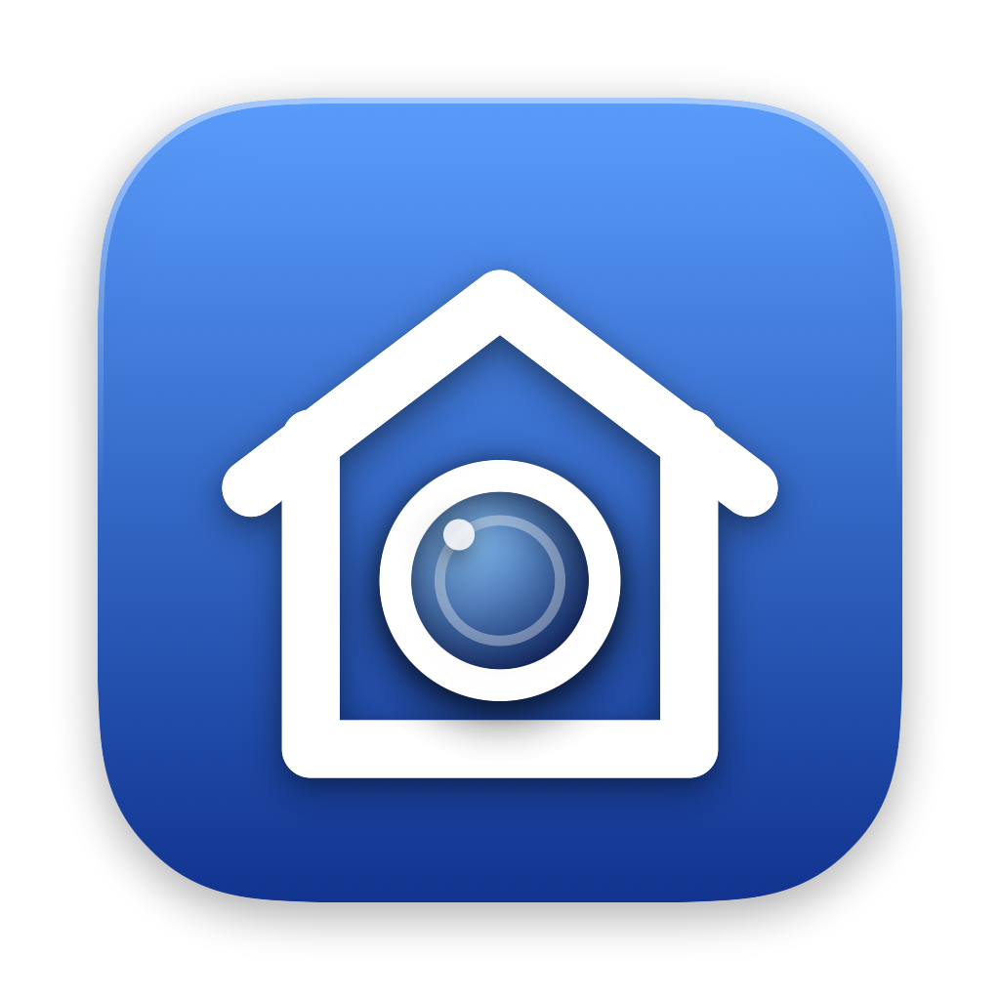

<div align="center">



# HomeLens

### Your Reolink camera in Apple Home — **live video + audio and HomeKit Secure Video in original 4K quality** — from a tiny native macOS app.

[](https://github.com/Flovflo/HomeLens/releases/latest)

[](https://www.apple.com/macos/)
[](https://swift.org)
[](https://developer.apple.com/apple-home/)
[](https://github.com/Flovflo/HomeLens/releases/latest)
[](LICENSE)
[](https://github.com/Flovflo/HomeLens/releases)

**Download the DMG, drag to Applications, open, follow the wizard. Nothing else to install.**

</div>

---

## Why HomeLens?

Apple's `HomeKit.framework` can **control** accessories — but it **cannot publish a camera**. So an ONVIF/RTSP camera like a Reolink simply can't appear in the Home app on its own. The usual answer (Scrypted, full Homebridge stacks) is heavy and general-purpose.

**HomeLens is the opposite: small, native, and laser-focused on one job — getting *your* camera into Apple Home, beautifully.** It pairs a tiny, reliable HomeKit bridge with a polished native macOS app for preview, status, and one-glance diagnostics.

```
   Reolink camera            Mac (HomeLens)                         Apple Home
   ┌────────────┐  RTSP/ONVIF ┌──────────────────────────┐   HAP   ┌──────────┐
   │  4K H.264   │────────────▶│  HomeKit bridge (HAP)     │────────▶│ iPhone   │
   │  + audio    │             │   • live video + audio   │  SRTP   │ HomePod  │
   │  sub stream │             │   • HomeKit Secure Video │◀───────▶│ Apple TV │
   └────────────┘             │   • ONVIF motion         │         └──────────┘
                              │   • Apple media engine   │
                              │                          │  HLS (local)
                              │  macOS app (SwiftUI)     │◀── live preview + diagnostics
                              └──────────────────────────┘
```

---

## ✨ Features

| | |
|---|---|
| 📺 **Live in Apple Home** | Real-time video **with audio** (Opus) on iPhone / iPad / Apple TV. On your Wi-Fi the **original 4K H.264** stream is sent untouched. |
| 🔴 **HomeKit Secure Video** | Recordings in **original quality up to 4K, H.264 or H.265**, on iOS/tvOS 27 hubs — no re-encoding, no quality loss. |
| 🎯 **Smooth, not just sharp** | Reolink cameras send video in bursts with erratic timestamps; HomeLens re-times and paces the stream so iPhone playback stays fluid. |
| ⚡ **Apple-silicon optimized** | **VideoToolbox** hardware encoding for remote/compatibility paths; **zero encoding** for original-quality streams. |
| 🖥️ **Native macOS app** | SwiftUI preview with **Fast / Quality** sources, mute toggle, live status pills. |
| 🩺 **End-to-end diagnostics** | One glance from **camera → relay → network/Apple → Home** — instantly see *where* it breaks. |
| 🔌 **Multi-NIC aware** | Pick the network interface; smart routing fixes the classic "stream negotiates but stays black" bug. |
| 🔒 **Secure by default** | Camera password in the **macOS Keychain**; credentials redacted from all logs. |
| 🏃 **Always on** | Runs 24/7 as a `launchd` agent with auto-restart — independent of the app window. |

---

## 🏗️ Architecture in 30 seconds

HomeLens is **two cleanly separated parts**:

1. **The bridge** (`homelensctl homekit-run`, managed by `launchd`) — the *reliability boundary*. It owns HomeKit pairing, live streaming, HSV recording, and ONVIF motion. It runs whether or not the app is open.
2. **The macOS app** (SwiftUI) — a *monitor*: live preview, status, and diagnostics. It never fights the bridge.

The bridge embeds a minimal [HAP-NodeJS](https://github.com/homebridge/HAP-NodeJS) helper (Apple has no public camera-accessory API), while everything else — config, secrets, health checks, supervision, diagnostics — is native Swift.

> 📖 Full write-up: [`docs/ARCHITECTURE.md`](docs/ARCHITECTURE.md)

---

## 🚀 Quick start

### Option A — Download the app (nothing else to install)
1. Download **[HomeLens.dmg](https://github.com/Flovflo/HomeLens/releases/latest)**.
2. Drag **HomeLens** to **Applications** and open it — the app is **signed and notarized by Apple**, so it opens with no warning.
3. Follow the wizard: camera address + password, then pair in the Home app.

**ffmpeg, ffprobe and Node.js are bundled inside the app** — nothing else to install, no Homebrew, no Terminal.

> Build the DMG yourself: `./script/package_app.sh && ./script/make_dmg.sh` → `dist/HomeLens.dmg` (see [docs/RELEASING.md](docs/RELEASING.md)).

### Option B — Build from source

#### Requirements
- **macOS 14+** (Apple Silicon recommended for the hardware media engine)
- **Homebrew**, **Node.js**, **ffmpeg**: `brew install node ffmpeg`
- A **Reolink** (or ONVIF/RTSP) camera on your LAN
- An **Apple Home hub** (HomePod / Apple TV) for HomeKit Secure Video

#### Install
```bash
git clone https://github.com/Flovflo/HomeLens.git
cd HomeLens

# 1. Helper dependencies
( cd Helpers/HomeKitBridge && npm install )

# 2. Configure your camera (password is stored in the Keychain)
swift run homelensctl init --host 192.168.0.6 --username admin
#   …or keep it out of shell history:
#   HOMELENS_PASSWORD='secret' swift run homelensctl init --host 192.168.0.6 --username admin

# 3. Prove the camera is reachable
swift run homelensctl doctor

# 4. Build the app + start the 24/7 bridge
./script/package_app.sh
./script/install_bridge_agent.sh
```

### Pair in Apple Home
Open the **Home** app → **Add Accessory** → *More options* → **HomeLens / Front Door** → enter the PIN:

```
031-45-154
```

The camera appears in Home with live view, audio, and (with a hub) Secure Video. For original 4K recordings, update all Home hubs to version 27, then select **Enregistrement Maison → Originale / 4K → Appliquer au pont** in HomeLens settings. Existing configurations retain compatibility mode until you change this setting.

See [the video pipeline audit and validation](docs/VIDEO_PIPELINE.md) for the exact quality policy and test results.

---

## 🩺 Built-in diagnostics

Stop guessing. Run the full-chain check from the terminal or the app's **Diagnostic** tab:

```bash
swift run homelensctl doctor
```

```
▸ Caméra        ✓ Ping  ✓ RTSP 4K+audio  ✓ ONVIF  ✓ Image
▸ Relai         ✓ ffmpeg  ✓ node  ✓ Pont actif  ✓ Port 51826
▸ Réseau/Apple  ✓ Internet  ✓ Bonjour « Front Door »  ✓ iCloud/HSV
▸ Apple Home    ✓ 3 appareils appairés  ✓ HSV activé  ✓ Audio live
```

Each link is green / orange / red with timings, so you see exactly where a problem is — camera, the local relay, the network, or Apple Home.

---

## 🛠️ CLI — `homelensctl`

| Command | What it does |
|---|---|
| `init …` | Save camera config; store the password in Keychain |
| `doctor` | Full end-to-end health check (color output) |
| `test rtsp \| onvif \| all` | Probe camera reachability |
| `test hsv-prebuffer` | Validate the HomeKit Secure Video fragment pipeline |
| `homekit-config` | Generate the HAP helper config |
| `homekit-run` | Run + supervise the HomeKit bridge (this is what `launchd` runs) |
| `run` | Long-running ONVIF motion monitor |

Pass `HOMELENS_PASSWORD` via the environment for unattended runs; set `HOMELENS_LOG_LEVEL=debug` for verbose diagnostics.

---

## ❓ FAQ

**Can it stream 4K live to my iPhone?**
Yes, on your local network with the Original / 4K setting: the camera's H.264 4K stream is sent to the iPhone untouched (Home's low-bitrate requests are ignored on the LAN, as Scrypted does). Away from home, the negotiated H.264 resolution is encoded with VideoToolbox. All Home hubs must run version 27 for 4K recordings.

**Why is Reolink live video choppy with other bridges?**
The camera emits video in bursts and its RTSP timestamps jump by more than a second after every keyframe. HomeLens re-times the packets without re-encoding and paces them to the iPhone with a small jitter margin. The measurements are in [docs/VIDEO_PIPELINE.md](docs/VIDEO_PIPELINE.md).

**My camera is H.265 — is that supported?**
Yes. Original-quality recordings preserve either H.264 or HEVC/H.265 on iOS/tvOS 27. Live view and compatibility-mode recordings use VideoToolbox to convert HEVC to H.264 when needed. The Mac preview plays either format. Restart the bridge after changing the camera codec.

**Does it use a lot of CPU?**
Native recording copies compressed video without decoding or encoding it. Live view and compatibility mode use the Apple Silicon media engine; actual CPU usage depends on the camera and concurrent streams.

**Multiple cameras?**
HomeLens is intentionally focused on **one camera, done right**.

---

## 📁 Project layout

```
Sources/
  HomeLensCore/      Shared engine: config, Keychain, RTSP/ONVIF, diagnostics
  HomeLensCLI/       homelensctl — the reliability-first CLI
  HomeLens/          SwiftUI macOS app (preview · status · diagnostics)
Helpers/HomeKitBridge/   Tiny HAP-NodeJS helper (publishes the camera to HomeKit)
script/              package_app.sh · install_bridge_agent.sh · …
docs/                ARCHITECTURE.md · CLI.md · FEASIBILITY.md
```

---

## 🤝 Contributing & support

- Something broken? Run `homelensctl doctor` and open an [issue](https://github.com/Flovflo/HomeLens/issues) with its output (passwords are never logged).
- Questions, other camera models, ideas → [Discussions](https://github.com/Flovflo/HomeLens/discussions).
- If HomeLens made your camera work in Apple Home, a ⭐ helps others find it.

License: [MIT](LICENSE).

---

## 🧰 Built with

**Swift 6 · SwiftUI · Swift Package Manager · AVFoundation / VideoToolbox · Network.framework · HAP-NodeJS · ffmpeg · ONVIF · RTSP**

---

> HomeLens is an independent project and is **not affiliated with, endorsed by, or sponsored by Apple Inc. or Reolink.** "Apple", "HomeKit", "Apple Home", and "HomeKit Secure Video" are trademarks of Apple Inc.

<div align="center">

**Made for people who just want their camera to *work* in Apple Home.** ❤️

</div>
